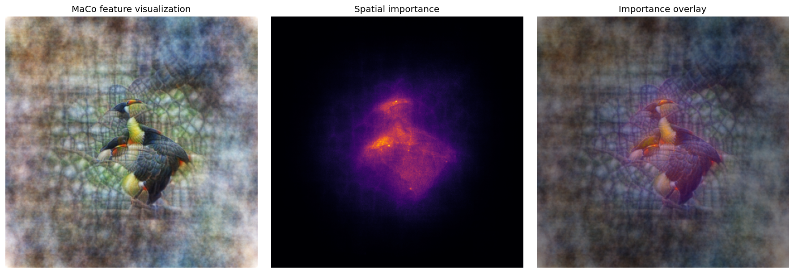

# DreamLens

DreamLens is a native PyTorch toolkit for understanding what neural-network
layers respond to. It keeps the pretrained model fixed and optimizes generated
images using feedback from internal activations.

The three main workflows are:

| Workflow | Question |
| --- | --- |
| `maximize()` | What image makes a selected layer/channel respond strongly? |
| `caricature()` | What features does the model see in an original image, and how can they be amplified? |
| `activation_atlas()` | What feature groups appear across many real images? |

DreamLens also includes a native PyTorch port of Xplique's complete
`features_visualizations` API: composable `Objective` targets, Fourier/pixel
`optimize`, MaCo, stochastic transforms, image regularizers, losses, and
preconditioning helpers.

## Setup

From the repository root:

```bash
python -m pip install -e ".[examples,atlas]"
```

The examples use pretrained torchvision models. Their weights may be downloaded
the first time they are used.

## Start with the learning notebooks

| Notebook | What it teaches | Saved output |
| --- | --- | --- |
| [`learn_dreamlens_maximize.ipynb`](examples/learn_dreamlens_maximize.ipynb) | Target, render config, Fourier canvas, optimization, score evaluation | `learning_outputs/dreamlens_maximize_notebook/` |
| [`learn_dreamlens_caricature.ipynb`](examples/learn_dreamlens_caricature.ipynb) | Original/generated paths, paired transforms, feature amplification | `learning_outputs/dreamlens_caricature_notebook/` |
| [`native_dreamlens_results.ipynb`](examples/native_dreamlens_results.ipynb) | Complete reproducible gallery with multiple channels and caricatures | `results/native_dreamlens_notebook/` |

To use a learning notebook:

1. Open it in Jupyter or VS Code.
2. Edit the clearly marked parameter cell.
3. Run all cells from top to bottom.
4. View the image and measurements in the notebook; the image is also saved to
   the output directory shown above.

Both learning notebooks include their latest verified result near the top, so
you can inspect the expected output before rerunning them.

## Verified maximize result


| Setting or measurement | Value |
| --- | ---: |
| Model / layer / channel | ResNet18 / `layer2.1.conv2` / `17` |
| Image size | `224 × 224` |
| Steps / learning rate | `400` / `0.012` |
| Final transformed-view score | `39.1118` |
| Clean untransformed norm | `43.8359` |
| Clean size-normalized RMS | `1.5656` |

The RMS score is included because a raw norm naturally increases when a larger
image produces more spatial activation values.

## Verified caricature result

<p>
  
  
</p>

| Setting or measurement | Value |
| --- | ---: |
| Model / layer | ResNet18 / `layer3.1.conv2` |
| Image size | `224 × 224` |
| Steps / learning rate / power | `200` / `0.009` / `1.20` |
| Clean cosine similarity | `0.7661` |
| Generated/original feature-norm ratio | `4.0172×` |
| Clean target projection | `191.0971` |

The original image is a fixed feature reference. The generated image starts
from Fourier noise and is optimized separately; it is not a normal image filter.

## Minimal API example

```python
from torchvision.models import ResNet18_Weights, resnet18

from dreamlens import FeatureTarget
from dreamlens import FeatureVisualizer
from dreamlens import RenderConfig
from dreamlens import TransformConfig

model = resnet18(weights=ResNet18_Weights.DEFAULT).eval()
visualizer = FeatureVisualizer(model, device="cpu", normalize=True)

target = FeatureTarget(
    layer=model.layer2[1].conv2,
    channel=17,
    reduction="norm",
)

result = visualizer.maximize(
    target=target,
    config=RenderConfig.reference(
        width=224,
        height=224,
        steps=400,
        lr=1.2e-2,
        transform=TransformConfig(
            rotate_degrees=6,
            scale_min=0.82,
            scale_max=1.12,
            translate_x=0.01,
            translate_y=0.01,
        ),
    ),
)

result.save("channel_17.png")
```

## Xplique-compatible feature visualization

The functional API mirrors `xplique.features_visualizations`, with tensors in
native PyTorch NCHW/CHW layout:

```python
import torch
from dreamlens.features_visualizations import Objective, optimize

model = model.eval()
objective = (
    Objective.channel(model, "layer2.1.conv2", [3, 17], input_shape=(3, 224, 224))
    + 0.25 * Objective.layer(model, "layer3.0.conv1", input_shape=(3, 224, 224))
)

saved_images, names = optimize(
    objective,
    nb_steps=256,
    custom_shape=(512, 512),
    transformations="standard",
)

# saved_images[-1] is [number_of_objective_combinations, 3, 512, 512]
```

## Native PyTorch MaCo

DreamLens includes a native PyTorch implementation of **MaCo (MAgnitude
Constrained Optimization)** from Fel et al.,
[“Unlocking Feature Visualization for Deeper Networks with MAgnitude
Constrained Optimization” (NeurIPS 2023)](https://arxiv.org/abs/2306.06805).

MaCo keeps a natural-image Fourier magnitude spectrum fixed and optimizes only
its phase. This constrains the generated visualization toward natural-image
statistics without using a learned generative prior. DreamLens also accumulates
the absolute input gradient during optimization and returns it as the spatial
importance/transparency map described in the paper.



| Setting | README result |
| --- | ---: |
| Model / target | torchvision ResNet18 / ImageNet class 96 (Toucan) |
| Canvas | `512 × 512` RGB |
| Steps / crops per step | `128` / `8` |
| Optimized variable | Fourier phase only |
| Fixed variable | Reference ImageNet Fourier magnitude |
| Returned tensors | image `[3, 512, 512]`, transparency `[3, 512, 512]` |

```python
import torch
from torchvision.models import ResNet18_Weights, resnet18

from dreamlens.features_visualizations import Objective, maco

model = resnet18(weights=ResNet18_Weights.DEFAULT).eval()

def imagenet_preprocess(images):
    mean = images.new_tensor([0.485, 0.456, 0.406]).view(1, 3, 1, 1)
    std = images.new_tensor([0.229, 0.224, 0.225]).view(1, 3, 1, 1)
    return (images - mean) / std

objective = Objective.neuron(
    model, "fc", 96, input_shape=(3, 224, 224)
)

image, transparency = maco(
    objective,
    nb_steps=128,
    nb_crops=8,
    noise_intensity=0.08,
    custom_shape=(512, 512),
    values_range=(0, 1),
    preprocess=imagenet_preprocess,
)
```

This implementation is PyTorch end to end: phase reconstruction uses
`torch.fft`, crops use differentiable `torch.nn.functional.grid_sample`, and
optimization uses `torch.optim.NAdam`. With no `maco_dataset`, the reference
ImageNet magnitude spectrum is downloaded and cached. A representative NCHW
dataset can be supplied to compute a domain-specific magnitude; grayscale MaCo
requires one.

See [`docs/XPLIQUE_FEATURE_VISUALIZATIONS.md`](docs/XPLIQUE_FEATURE_VISUALIZATIONS.md)
for the complete ported surface and the explicit PyTorch/Keras shape difference.

The self-contained PyTorch API tutorial is
[`Feature_Visualization_Getting_started_PyTorch.ipynb`](examples/Feature_Visualization_Getting_started_PyTorch.ipynb).
It imports DreamLens normally, loads a pretrained torchvision ResNet18, explains
the objective and optimization APIs, runs all 1024 steps, and saves the raw
canvas, display image, and trajectory under
`results/feature_visualization_getting_started_pytorch/`.

Use the learning notebooks for the full editable transform configuration,
reproducible seeds, plots, and clean-score evaluation.

## Where Fourier is used

```text
random trainable Fourier coefficients
→ frequency scaling
→ inverse FFT (`torch.fft.irfft2`)
→ color mixing and sigmoid
→ ordinary RGB image
→ frozen neural network
```

The inverse FFT happens before model inference. The model never receives
Fourier coefficients, and a forward FFT is not required when generation starts
directly from coefficients.

## More information

- Public package code: [`src/dreamlens/`](src/dreamlens/)
- Full API and capability guide:
  [`docs/DREAMLENS_FEATURE_GUIDE.md`](docs/DREAMLENS_FEATURE_GUIDE.md)

Run the smoke tests with:

```bash
PYTHONPATH=src pytest -q
```
